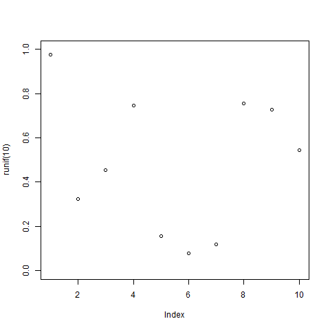
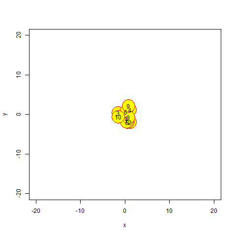
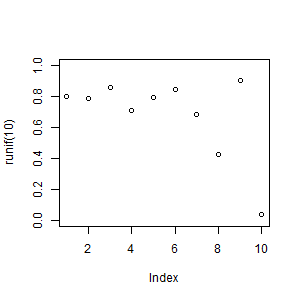

```{r setup, include=FALSE}
knitr::opts_chunk$set(echo = TRUE, cache = T, warning = F, message = F)
```


A short review of some methods allowing to create animations in R is presented bellow. 

<!--more-->

### Available options

* library(animation)
    * [saveGIF](https://yihui.name/animation/example/savegif/) (relies on ImageMagick or GraphicsMagick)
    * [saveVideo](https://yihui.name/animation/example/savevideo/)
    * [saveMovie](https://github.com/tidyverse/ggplot2/wiki/Using-ggplot2-animations-to-demonstrate-several-parallel-numerical-experiments-in-a-single-layout)
    * [saveHTML](https://yihui.name/animation/example/savehtml/)
    * [other functions here](https://cran.r-project.org/web/packages/animation/animation.pdf)

* [gganimate](https://github.com/dgrtwo/gganimate)
    * additional use of package [tweenr](http://blog.revolutionanalytics.com/2017/05/tweenr.html) makes a result smother

* [animated maps](https://ryanpeek.github.io/2016-10-19-animated-gif_maps_in_R/)

### saveGIF

saveGIF requires to for ImageMagick or GraphicsMagick to be installed. 

* ImageMagick ([how to install on MAC](https://encodable.com/install_imagemagick_on_mac_osx/))
* GraphicsMagick ([how ot install GraphicsMagick on Windows](http://www.graphicsmagick.org/INSTALL-windows.html)). In saveGIF function, you have to use option convert = 'gm convert'
* alternativelly, one can use installr::install.ImageMagick()

```{r, echo=FALSE}
prefix <- '2017-11-22-animation_files'
if(!dir.exists(prefix)) dir.create(prefix)
```

```{r}
if(!dir.exists(paste0(prefix, "/movies"))) 
  dir.create(paste0(prefix, "/movies"))
```

```{r}
library(animation)
library(ggplot2)
  
saveGIF({
    for (i in 1:10) 
      plot(runif(10), ylim = 0:1)
        }, 
        convert = 'gm convert', 
        movie.name = paste0(prefix, "/test1.gif"))
```



#### Brownian motion example from animation::brownian.motion

```{r}
saveGIF({
  brownian.motion(
    pch = 21,
    cex = 5,
    col = "red",
    bg = "yellow"
  )
},
movie.name = paste0(prefix, "/movies/brownian_motion2.gif"),
interval = runif(30, 0.01, 1),
nmax = 30, convert = 'gm convert')
```



_Note:_ Number of steps is controled by nmax in saveGIF. Alternativelly, you change this globally with
ani.options("nmax" = 50)

#### Adaptation for your task 

Look at function brownian.motion and create your own by analogy

```{r}
brownian.motion
```

Make your own

```{r}
my_plot <- function() {
  for (i in 1:10)
    plot(runif(10), ylim = 0:1)
}

saveGIF({
  my_plot()
}, movie.name = paste0(prefix, "/movies/example2.gif"),
convert = 'gm convert')

```



